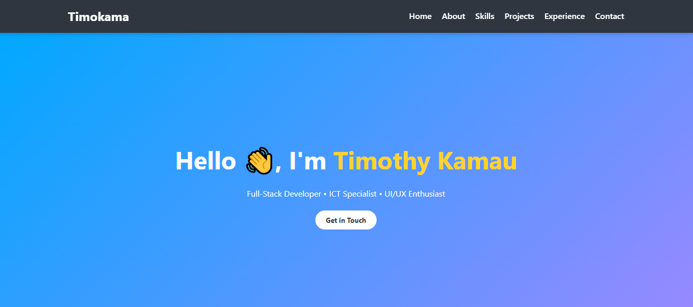

# 🌐 Timothy Kamau — Portfolio

Welcome to the source code of my personal portfolio website 👉 [timokama.github.io](https://timokama.github.io)

This portfolio highlights my skills, projects, and professional journey in **Full-Stack Development, ICT, and UI/UX design**.

---

## 🚀 Features
- Responsive modern UI built with **HTML, CSS, JavaScript**
- **Mobile-friendly navigation** with a hamburger menu
- Showcases my **skills, projects, and work experience**
- Integrated **contact section** with links to GitHub & LinkedIn
- Simple and clean design for easy customization

---

## 🛠️ Tech Stack
- **Frontend:** HTML5, CSS3, JavaScript
- **Icons & UI:** Font Awesome
- **Version Control:** Git & GitHub Pages (for hosting)

---

## 📸 Preview
  
*(Add a screenshot of your portfolio inside an `assets/` folder and update this path.)*

---

## 📂 Projects Highlighted
- **Freelance Web Apps** — Responsive websites for SMEs
- **ALX Learning Platform** — REST APIs & authentication
- **Personal Portfolio** — Designed with modern UI/UX

---

## 👨‍💻 About Me
I’m **Timothy Kamau**, a passionate developer and ICT specialist from Kenya 🇰🇪.  
I enjoy building clean, scalable solutions and helping businesses go digital.  

---

## 📬 Contact
- **Email:** [timo.munyiri@gmail.com](mailto:timo.munyiri@gmail.com)  
- **GitHub:** [github.com/Timokama](https://github.com/Timokama)  
- **LinkedIn:** [linkedin.com/in/timothy-munyiri-b154a937b/](https://www.linkedin.com/in/timothy-munyiri-b154a937b/)

---

### ⭐️ If you like this portfolio, give this repo a star!
